# Developer Guide
The design documentation is in general for anyone who wants to understand the system architecture and design of 
Pac. The following groups are in particular the intended audience of the document.

- PAC project managers
- PAC developers
- PAC software testers

## Table of Contents
1. [Setting Up](#1-setting-up)  
    1.1 [Requirements](#11-requirements)  
    1.2 [Startup using Command Line](#12-startup-using-command-line)  
    1.3 [Startup using Jar](#13-startup-using-jar)  
2. [Design](#2-design)  
    2.1 [Architecture](#21-overall-architecture)  
    2.2 [UI component](#22-ui-component)  
    2.3 [Command component](#23-command-component)  
    2.4 [Parse component](#24-parser-component)  
    2.5 [Storage component](#25-storage-component)  
3. [Implementation](#3-implementation)  
    3.1 [Event](#31-event)  
    3.2 [Attendance](#32-attendance)  
    3.3 [Calendar](#33-calendar)  
    3.4 [Performance](#34-performance)  
    3.5 [Student List Collection](#35-student-list-collection)  
    3.6 [Help](#36-help)

[Appendix A: Target User Profile](#appendix-a-target-user-profile)   
[Appendix B: Value Proposition](#appendix-b-value-proposition)  
[Appendix C: Non-functional requirements](#appendix-c-non-functional-requirements)  
[Appendix D: User Stories](#appendix-d-user-stories)    
[Appendix E: Instructions for Manual Testing](#appendix-e-instructions-for-manual-testing)  
[Glossary](#glossary)  

## 1. Setting Up

### 1.1 Requirements 
1.  Ensure you have [Java 11](https://www.oracle.com/java/technologies/javase-jdk11-downloads.html) 
or above installed in your Computer.
1.  Download the latest PAC.jar from [here](https://github.com/AY1920S2-CS2113T-T12-4/tp/releases).
1.  Copy the file to the folder you want to use as the home folder for this application.
1.  Type `java -jar PAC.jar` to start the application.
1.  You should see this screen if everything is successful.

### 1.2 Startup using Command Line
1.  Open your terminal.
1.  Navigate to the home folder containing PAC.
1.  cd followed by the file path into the terminal as shown below
    <INSERT IMAGE> 
1.  Type `java -jar` followed by the name of the jar file and press **Enter**.

### 1.3 Startup using JAR
1.  Open home folder containing PAC.
1.  Run the packaged JAR file by double clicking it 
    and a window should appear in a few seconds.
    <INSERT IMAGE>
1. Once opened, type in the command when prompted and press **Enter**.

## 2. Design

### 2.1 Overall Architecture
This section presents the architecture of PAC. It explains the architecture of main components of PAC.

              
*Overall architecture design of Pac*

The `Pac` component contains all other components in the application.

- `UI`: reads user input, and prints output in pre-defined format.
- `Storage`: loads/stores all events (in EventList) and all student lists (in StudentListCollection).
- `CommandInterpreter`: Determines category and type of command from user input.
- Various `Parser`: Breaks down user input to obtain command parameters.
- Various `Features`: stores their respective objects during runtime.
    - `EventList`: stores all events during runtime.
    - `StudentListCollection`: stores all student lists during runtime.
    - `AttendanceList`: stores all attendances related to an `Event`.
    - `PerformanceList`: stores all performances related to an `Event`.
    - `Calendar`: shows all events in calendar form.

### 2.2 UI component
                
*Class diagram of the UI component*   

UI is the main class handles user display, which includes reading user input and printing information 
back to the user on command-line.  
Besides the normal command line messages, there are two subclasses of UI: 
DisplayList and DisplayTable, to specifically print the list and table interface to professor. 

### 2.3 Command component
         
*Class diagram of the Command component*  

The diagram above shows all commands in this program, which are grouped under 
their own categories (i.e. *StudentList-related*, *Event-related*, 
*Attendance-related*, *Performance-related*). All these commands inherit the 
base `Command` abstract class and utilize its abstract `execute()` method. 
They are created and executed when the user inputs a corresponding command.
 
### 2.4 Parser component
*Class diagram of the Parser component*  
There are total of four Parser classes as shown below. Each Parser class correspond to a feature 
of Pac. 

| Parser                    | Created in                                                    |
|---------------------------|---------------------------------------------------------------|
| EventParser               | EventCommandInterpreter                                       | 
| CalenderParser            | EventCommandInterpreter                                       | 
| PerformanceParser         | Step-by-step command at performance-related command classes   |  
| AttendanceParser          | Step-by-step command at attendance-related command classes    |  

A Parser class is created when a user input contains data to be stored or used in certain features.    

### 2.5 Storage component
            
*Class diagram of the Storage component*

On startup, `Pac` instantiates two `Storage` objects (`eventStorage` and 
`studentListStorage`) to load and save `Event` and `StudentList` objects respectively.

All `Event` and `StudentList` objects are receiving `Bye` command. If the 
program crashes (due to unhandled Exception or Interrupt), they *will not* be 
saved.

## 3. Implementation  
### 3.1 Event
               
*Class diagram of the Event component*
The Event features allow users to update and keep track of their schedules.

#### Program flow
1. When a user enters an event-related command, the command is analysed by `EventCommandInterpreter`. 
1. The first word is extracted by `getFirstWord` to determine the `commandType`.
1. If this `commandType` requires further arguments, subsequent words are 
extracted, and parsed by `EventParser` to retrieve the relevant information 
(e.g. index, name, time, date, venue).
1. Alternate paths are chosen based on `commandType`, where a corresponding 
`Command` class is created, with the information extracted from the previous 
step passed into it. 
    - e.g. Command `event delete i/1` will create a `DeleteEvent` object, with 
    `index=1` as its argument.
1. This command is returned to `CommandInterpreter#decideCommand()` which returns to `Pac#run()` to call `Command#execute()`. 

The diagram below illustrates the program flow stated above, with the command 
`event delete i/1`.
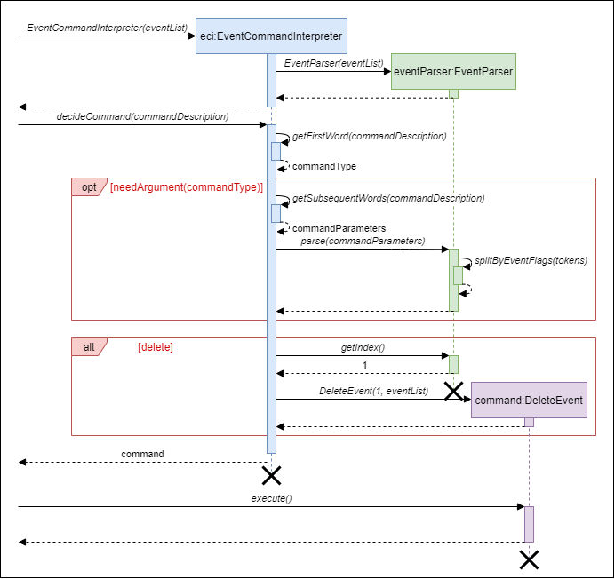

In this diagram:
* Other alternative paths are not shown (e.g. [add], [editEvent], [list], etc.).
* The details after `Command#execute()` is not shown.

Note that:
* `datetime` is stored as a single attribute in `Event` class, but it is exposed to user as `date` 
and `time`, which corresponds to `d/` and `t/` flag respectively.
* `editDate` or `editTime` commands are not available. Only `editDateTime` is available to change the 
`date` and/or `time` of an `Event` object.
* `delete(Event)` method is currently not in use, but can be used to implement delete by event name, 
either by complete match, or fuzzy match.
* Any classes (e.g. `Seminar`) that inherit from `Event` class will have similar program flow. 

### 3.2 Attendance
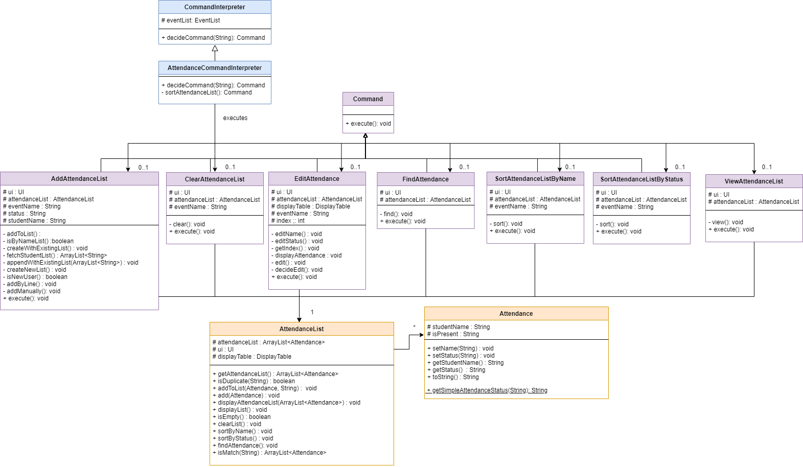        
*Class diagram of the Attendance component*    
The Attendance features allow users to update and keep track of their students' attendance for a Event.

#### Attendance Command Interpreter
Attendance Command Interpreter interprets the user input when it belongs to the attendance category.
When user input is passed to Attendance Command Interpreter, it extracts the second word in the user
input and decides whether the string can be interpreted as a valid Command. If valid, the interpreter
returns its corresponding Command. Else, the interpreter will throw PacException to inform the user 
that the string is interpreted as an invalid Command.
Below shows the flow chart and sequence diagram of Attendance Command Interpreter.  
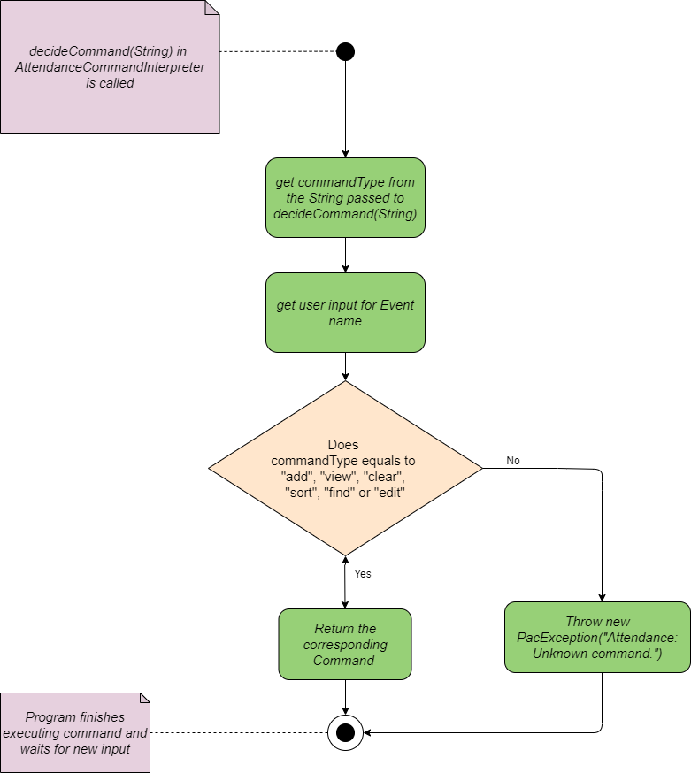  
*Flow Chart of Attendance Command Interpreter*  
  
*Sequence diagram of Attendance Command Interpreter*  

#### Program flow
1. When a user enters an attendance-related command, the command is analysed by `AttendanceCommandInterpreter`. 
1. Once determined, the relevant class that corresponds to the type of command is created.
1. Then, the class will execute base on its function. It modifies `AttendanceList`.
1. These commands are then returned to `Pac.run()` to `execute()`. 

Note that:
* `attendance add` command provides to use an existing list stored under `StudentListCollection` or to create 
a new list. If you choose to use an existing list, you need to ensure that there are existing `StudentList` in
the `StudentListCollection`. If you choose to create a new list, you will be given an option of a multi-line or 
single line interaction. If you are a new user, you will be assigned to use the multi-line entering of student
attendance data. If you are not a new user, you will assigned to use the single line entering of student
attendance data. `n/` and `p/` flags are used to insert new attendance.

#### Features under Attendance
There are 6 features for attendance in total, as shown below. 
The features will be presented in the order of sequence diagram, followed by description.  

1. Add attendanceList  
    
*Sequence diagram of AddAttendanceList*   
 
1. Clear attendanceList    
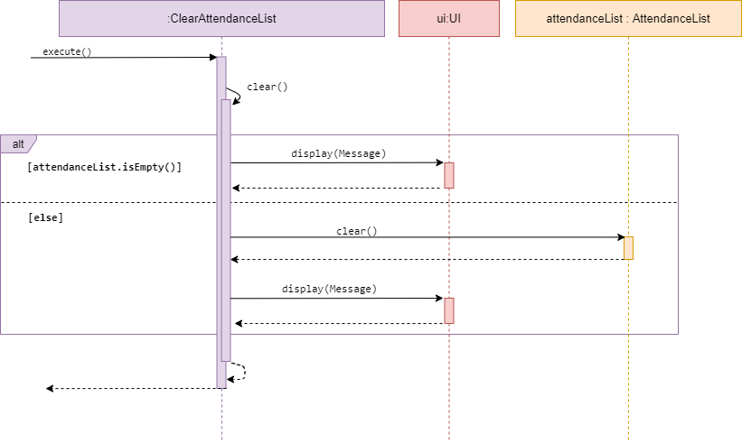    
*Sequence diagram of ClearAttendanceList*
ClearAttendanceList is a subclass of Command. It allows the user to clear an existing attendance list under an Event.  
The method clear() accesses the desired attendanceList of a given event, and checks whether the list is empty.
If empty, it calls display() in UI and inform the user list is empty. Else, it will clear the existing attendance list 
stored under the given event.

1. View attendanceList  
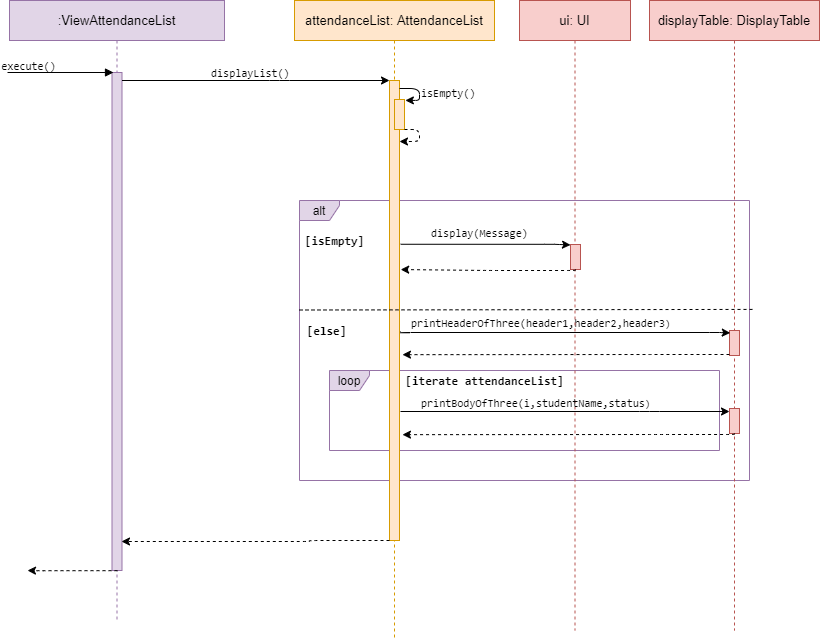     
*Sequence diagram of ViewAttendanceList*    
ViewAttendanceList is a subclass of Command. It allows the user to view a self generated table based on the data 
in a desired attendance list.  
The method view() accesses the desired attendanceList of given event, and checks whether the list is empty.  
If empty, it calls display() in UI and inform the user list is empty. Else, it will iterate through the attendanceList 
and print Attendance data in a table format.  

1. Sort attendanceList  
    1.    
    *Sequence diagram of SortAttendanceListByName*    
    
    1. 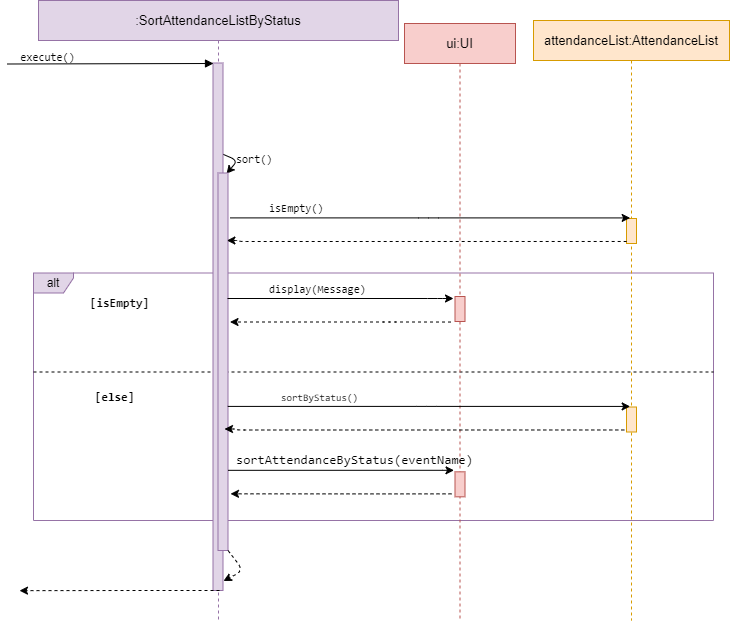    
    *Sequence diagram of SortAttendanceListByStatus*    
`SortAttendanceListByName` and `SortAttendanceListByStatus` are subclasses of Command. 
They both allow the user to sort a attendance list by either the student's name or status.
The two Commands will be discussed together in this section as they have similar behaviour.  
The methods `SortAttendanceListByName` and `SortAttendanceListByStatus` access a desired `attendanceList` and check whether 
the list is empty. 
If empty, it calls display() in UI and inform the user list is empty.  
Else, it will sort the `attendanceList` by the type mentioned in its method name.  

1. Edit attendance  
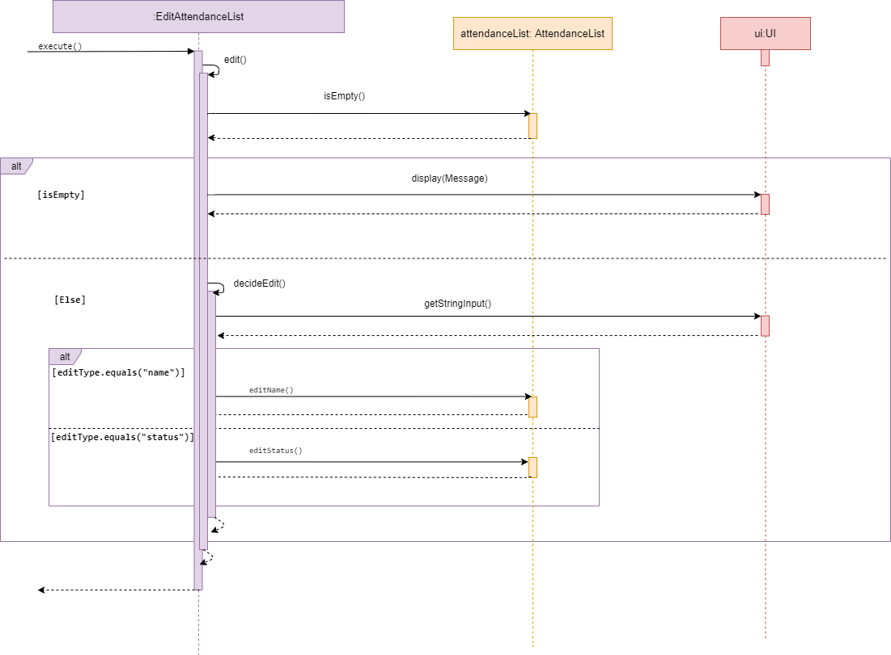    
*Sequence diagram of EditAttendance*  
`EditAttendance` is a subclass of Command. It allows the user to edit an `attendance`,
either the student's name or status, from a desired `attendanceList` under an Event.  
The method edit() accesses the desired `attendanceList` of given event, and checks whether the list is empty.
If empty, it calls display() in UI and inform the user list is empty. Else, it will call decideEdit() from itself.
The method decideEdit() 

1. Find attendance  
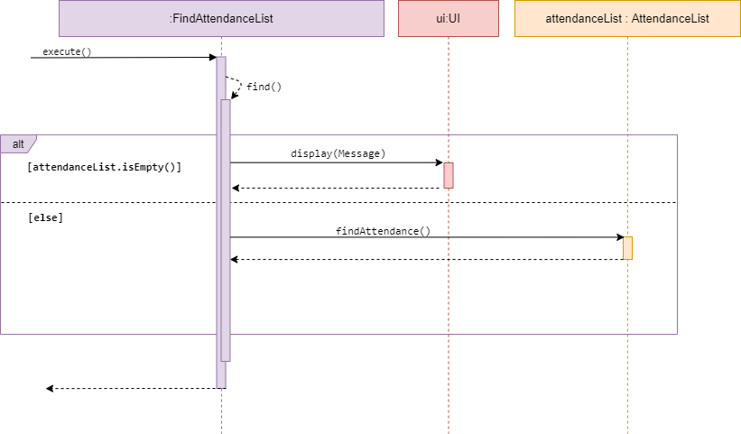  
*Sequence diagram of FindAttendance*  
`FindAttendance` is a subclass of Command. It allows the user to find an `attendance`.
The method find() accesses the desired `attendanceList` of given event, and checks whether the list is empty.
If empty, it calls display() in UI and inform the user list is empty. Else, it will call findAttendance() from 
`attendanceList`.

### 3.3 Calendar
*Figure 2: Class diagram of the Calendar component*

#### Program flow
1. When a user enters a calendar-related command, the command is analysed by `CalendarCommandInterpreter`.
1. Once determined, the relevant information (eg. semester, academic year) are extracted by `CalendarParser`.
1. Then, either AddFirstSemester or AddSecondSemester class that corresponds the semester number is created. 
1. Subsequently, it separates events by the required month and year in `CalendarList`
1. These commands are then returned to `Pac.run()` to `execute()`. 

Note that:
* `acadamic year` is parsed into corresponding to only one year according to the semester in `EventParser` class.
* Calendar view of the whole year is not available. Only semester 1 or 2 of an academic year can be viewed at a time.
* Event name size must be less than 10 characters to be displayed neatly (current implementation), however
it can be implement to truncate longer names to fit nicely

### 3.4 Performance
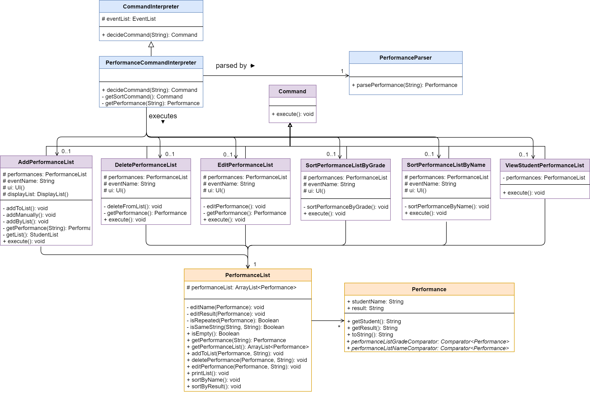
*Class diagram of the Performance component*  
The Performance features allow users to update and keep track of their students' result for a Event.    
#### Performance Command Interpreter
Performance Command Interpreter interprets the user input when it belongs to the
performance category. 
When user input is passed to Performance Command Interpreter, it extracts the 
second word in the user input and decides whether that string can be interpreted to a
valid Command. If valid, the interpreter returns its corresponding Command. 
If invalid, the interpreter throws PacException to inform the user. 
Below shows the flow chart and sequence diagram of 
Performance Command Interpreter.  
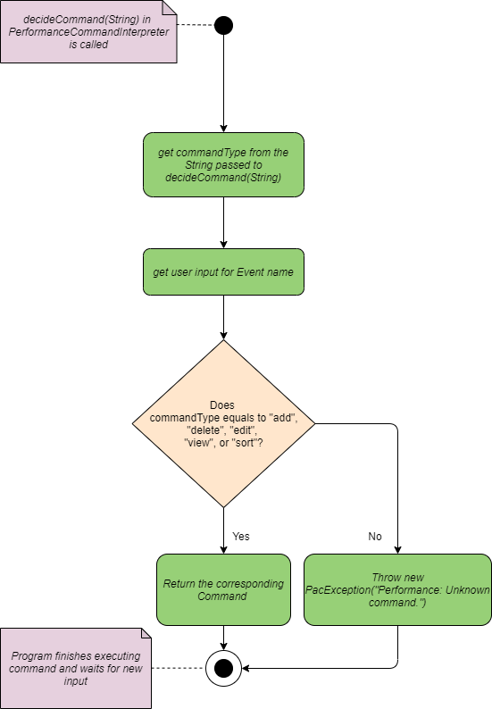  
*Flow Chart of Performance Command Interpreter*  
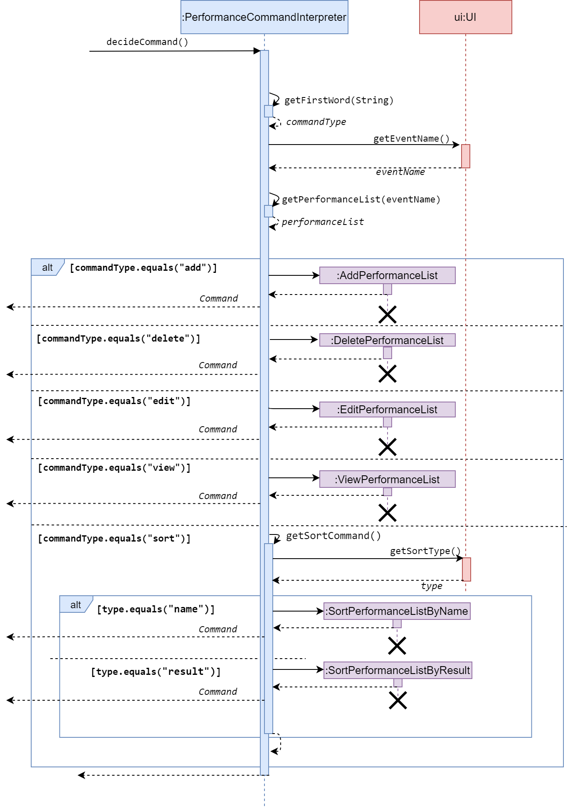 
*Sequence diagram of Performance Command Interpreter*  

#### Program flow
1. When a user enters a performance-related command, the command is analysed by 
[PerformanceCommandInterpreter](#-performance-command-interpreter). 
1. Once determined, the relevant class that corresponds to the command is created (e.g. AddPerformance, 
DeletePerformance...), and ask for relevant information (e.g. event name, student name, student result) from the user. 
1. Then, with the information extracted from the previous step passed into it. It modifies PerformanceList` under
the event class correspond to the input event name.
1. These commands are then returned to `Pac.run()` to `execute()`. 
 
Note that:
* All PerformanceList class are created under an Event. A PerformanceList cannot exist 
by its own. 
* All Performance commands are step-by-step commands. This aims to provide convenience to the user by 
prompting instructions and correct command format.  
* All Performance discussed in Pac are constructed with student's name and result.

#### Features under Performance
There are 5 features for Performance in total, as shown below. 
The features will be presented in the order of sequence diagram, followed by description.  
 
1. Add performanceList

*Sequence diagram of AddPerformanceList*  
AddPerformanceList is a subclass of Command. It allows the user to add performances
by importing a student list, or add manually, to a desired performance list under an Event.    
The method execute() calls addToList() from the same class, which then calls 
isImportList() from UI to get a user input. This user input decides whether 
the user will add performances by list or manually. 
The method addByList() or addManually() will then get user input for Performance parameters, 
which will be parsed by the PerformanceParser and return a Performance.  
The Performance attained from the parser will be added to a desired performanceList. 

1. Delete performanceList

*Sequence diagram of AddPerformance*  
DeletePerformanceList is a subclass of Command. It allows the user to delete a performance
from a desired performance list under an Event.  
The method execute() calls deletePerformance() from the same class, which then calls 
getPerformance() from itself to get the user input, Performance parameters 
of the Performance to be deleted, and return a Performance.  
The Performance attained from getPerformance() will be deleted from a desired performanceList. 

1. Edit performanceList
  
*Sequence diagram of EditPerformance*  
EditPerformanceList is a subclass of Command. It allows the user to edit a performance,
either the student's name or result, from a desired performance list under an Event.  
The method execute() calls editPerformanceList() from the same class, which then calls 
getPerformance() from itself, to get the user input, student's name of the 
Performance to be edited, and return a Performance.  
The method editPerformanceList() then calls getPerformanceParameter() from UI 
to get a user input. This user input decides whether the user will edit the 
student's name or result.  
The new parameter will be attained from the user in method editPerformance(performance, editType) 
in PerformanceList.  

1. Sort performanceList
    1. 
    *Sequence diagram of SortPerformanceListByName*  
    
    1. 
    *Sequence diagram of SortPerformanceListByResult*  
SortPerformanceListByName and SortPerformanceListByResult are subclasses of Command. 
They both allow the user to sort a performance list, by student's name or result as their
name suggest. 
The two Commands are discussed together in this section as they have similar behaviour.  
The method execute() calls sortPerformanceByName() or sortPerformanceByResult, 
according to its class name.   
The methods sortPerformanceBy...() access a desired performanceList and check whether 
the list is empty. 
If empty, it calls display() in UI and inform the user.  
Else, it will sort the performanceList by the type mentioned in its method name.  

1. View performanceList  

*Sequence diagram of ViewPerformanceList*  
ViewPerformanceList is a subclass of Command. It allows the user to view a self
generated table based on the data in a desired performance list.  
The method execute() calls viewList() from the same class, which accesses a 
desired performanceList of given event and checks whether that list is empty.  
If empty, viewList() calls display() in UI and inform the user.  
Else, it will iterate through the performanceList and print Performance 
data in a table format.  

### 3.5 Student List Collection
     
*Class diagram of the Student component* 

The Student list features allow users to store a list of student names, which could be used
when updating students' attendance and performance data conveniently.  

#### Program Flow   
1. When a user enters an studentList-related command, the command is analysed by `StudentCommandInterpreter`. 
1. Once determined, the relevant class that corresponds to the type of command is created.
1. Then, the class will execute base on its function. It modifies `StudentList`.
1. These commands are then returned to `Pac.run()` to `execute()`. 

Note that:
* studentList-related commands can be executed without the existence of events.

#### Student Command Interpreter
Student Command Interpreter interprets the user input when it belongs to the
student category. 
When user input is passed to Student Command Interpreter, it extracts the second word in the user input 
and decides whether that string can be interpreted to a valid Command. If valid, the interpreter returns 
its corresponding Command.  If invalid, the interpreter throws PacException to inform the user. 
Below shows the flow chart and sequence diagram of Student Command Interpreter.    
    
*Flow Chart of Student Command Interpreter*    
   
*Sequence diagram of Student Command Interpreter*    

#### Features under Student List Collection

There are 6 features for Student in total, as shown below. 
The features will be presented in the order of sequence diagram, followed by description.  

1. Add student list
  
 *Sequence diagram of AddStudentList*   
`AddStudentList` is a subclass of Command. It allows the user to add a student list
to the `studentListCollection`.    
The method execute() calls addToList() from the same class, which then calls 
getListName() from UI to get a user input for listName.  
The list name of student list is restricted to one word only, hence the parameter listName 
is trimmed.  
StudentList, a new student list is created with list name listName.  
The method addToList() calls addStudent(studentList) from UI to get user input 
for student names to be added. The names are added to studentList
in addStudent(studentList).  
After user has done input, `studentList` will be printed, and this new list is
added to `studentListCollection`.
 
1. Delete student list  
  
 *Sequence diagram of DeleteStudentList*  
`DeleteStudentList` is a subclass of Command. It allows the user to delete a student list
from the studentListCollection.    
If the `studentListCollection` is empty, execute() calls displayStudentListCollectionEmpty()
form UI, to inform the user.  
Else, it calls deleteFromExisting() from the same class and get user input for index, the
list number to be deleted.  
The (index-1)th list in `studentListCollection` is deleted.  

1. Clear student list  
  
 *Sequence diagram of ClearStudentList*  
`ClearStudentList` is a subclass of Command. It allows the user to clear the 
`studentListCollection`.  
The method execute() calls clear() from the same class. 
If the `studentListCollection` is empty, clear() calls displayStudentListCollectionEmpty()
from UI, to inform the user.  
Else, it calls clear() from `StudentListCollection` to clear the collection. 
The user will get informed when a success clear has been performed. 

1. View student list  
  
 *Sequence diagram of ViewStudentList*   
`ViewStudentList` is a subclass of Command. It allows the user to view a self 
generated table based on the data in `studentListCollection`.  
The method execute() calls displayStudentList() from the same class. 
If the `studentListCollection` is empty, displayStudentList() calls 
displayStudentListCollectionEmpty() from UI, to inform the user.  
Else, it calls printStudentListCollection() from UI to print the table. 

1. Find student list   
   
 *Sequence diagram of FindStudentList*   
`FindStudentList` is a subclass of Command. It allows the user to find a certain `studentList`
in `studentListCollection`.
The method execute() calls find() from the same class.
If the `studentListCollection` is empty, displayStudentList() calls 
displayStudentListCollectionEmpty() from UI, to inform the user.  
Else, it calls displayStudentListCollection() from the same class to print the table.
Next, it will prompt the user for a keyword. Using the keyword, it will iterate through 
the `studentListCollection` to find a `studentListCollection` listName that equals to the keyword.
Last, it will call printSearchResults from displayList to display the searchResults found.
The user will get informed when a success sort has been performed. 
 
1. Sort student list   
*Sequence diagram of SortAttendanceList*
    1.    
    *Sequence diagram of SortStudentListByName*    
    
    1.     
    *Sequence diagram of SortStudentListByList*    
`SortStudentListByName` and `SortStudentListByList` are subclasses of Command. 
They both allow the user to sort a student list by either the student's name within a list or 
the list name of `studentList` stored within the `studentListCollection`.
The two Commands will be discussed together in this section as they have similar behaviour.  
The methods `SortStudentListByName` and `SortStudentListByList` access a desired `studentListCollection` and 
check whether the collection is empty. 
If empty, it calls display() in UI and inform the user list is empty.  
Else, it will sort the `studentListCollection` or `studentList` by the type mentioned in its method name.  

### 3.6 Help
  
*Sequence diagram for Help*  
Help function provides a summary of command format for the user.  
When help command is executed, a menu page is shown at the console. 
It then calls getStringInput() from UI, to get user input, typeOfHelp, and prints
corresponding help information to user.  

## Appendix

### Appendix A: Target user profile
Our target audiences are professors who need help organizing their personal work schedule and need more time.
The professors are pressed for time and they require a simple software to organize their monthly events
and keep track of their students' attendance and performance. 

### Appendix B: Value proposition
Our application will reduce the stress of the professor by allowing them to easily enter and store
their work schedule as well as their students' records. After storing the data, the Professor can have
quick access to the information in either a list or a calendar view. 

## Appendix C: Non-Functional Requirements

1. Should work on any mainstream OS as long as it has 
[Java 11](https://www.oracle.com/java/technologies/javase-jdk11-downloads.html) or above installed.
1. Should be able to hold up to 100 events without a noticeable sluggishness in performance for 
typical usage.
1. A user with above average typing speed for regular English text (i.e. not code, not 
system admin commands) should be able to accomplish most of the tasks faster using commands 
than using the mouse.

{More to be added in future revisions}

## Appendix D: User Stories

|Version| As a ... | I want to ... | So that I can ...|
|--------|----------|---------------|------------------|
|v1.0|professor|add new events|creating new events|
|v1.0|professor|delete existing events|delete unnecessary events|
|v1.0|professor|add new attendance list|create new attendance list to be added to events|
|v1.0|professor|delete existing attendance list|delete unnecessary attendance list|
|v1.0|professor|add new performance list|create new performance list to be added to events|
|v1.0|professor|delete existing performance list|delete unnecessary performance list|
|v1.0|professor|add date and time to my events|organize my events|
|v1.0|professor|add venue to my events|locate events|
|v1.0|professor|edit my events|update my existing events|
|v2.0|professor|create a student list|link existing student list to performance list or attendance list|
|v2.0|professor|Create repeatable events without having the need to manually add in|easily create occurring events|
|v2.0|professor|find an event by name|locate an event without having to go through the entire list|
|v2.0|professor|view calendar of all my events|to see a overview of them|
|v2.1|professor|edit my student's attendance|update my existing student's attendance|
|v2.1|professor|find my student's attendance|locate an existing student's attendance|

## Appendix E: Instructions for Manual Testing
#### Set up
1. Download the jar file and copy it into an empty folder.
1. Run the jar file by typing java -jar Pac-2.1.jar after going into the file's home directory 
folder in command terminal.  
 
#### Follow **all-in-one** command for following commands:  
**Event**
1. Add an event by typing  
`event add n/NAME`
1. View the populated events by typing  
`event list`
1. View the populated seminars by typing  
`seminar list`
1. Delete an event by typing  
`delete i/INDEX`
1. Edit an existing event's name by typing  
`event editname i/INDEX n/NAME`
1. Edit an existing event's date and time by typing  
`event editdatetime i/INDEX d/DATE t/TIME`
1. Edit an existing event's venue by typing   
`event editvenue i/INDEX v/VENUE`  

**Calender**
The Calender features allow users to view their schedule by semesters. Since our target
users are professors, this feature allows our target user to manage their schedules in a 
way which is more related to their daily life.   
  
1. Display calendar by entering  
`calendar s/SEMESTER ay/YEAR_ONE-YEAR_TWO`   

#### Follow **step-by-step** command for following commands:  

**Attendance**
1. Add attendance to attendance list by typing  
`attendance add`
1. Clear attendance list by typing  
`attendance clear`
1. View generated table for attendance list by typing  
`attendance view`  
1. Sort attendance list by typing  
`attendance sort`  
1. Find attendance by typing  
`attendance find`  
1. Edit attendance by typing  
`attendance edit`  
 
**Performance**
1. Add performance to performance list by typing  
`performance add`
1. Delete a performance from performance list by typing  
`performance delete`
1. View generated table for performance list by typing  
`performance view` 
1. Edit performance list by typing  
`performance edit`
1. Sort performance list by typing  
`performance sort`  

**Student name list**
1. Add name to student name list by typing  
`studentlist add`
1. Delete name from student name list by typing  
`studentlist delete`
1. View generated table for student name list by typing  
`studentlist view` 
1. Find a student name in student name list by typing  
`studentlist find`
1. Sort student list by typing  
`studentlist sort`

## Glossary

* *flag* - anything that takes the form of  `?/`, e.g. `n/`, `i/`
* *student list* - a list of students' name
* *student list collection* - a collection of list of students' name
* *attendance* - a combination of student's name and attendance status
* *attendance list* - a list of students' name and attendance status
* *performance* - a combination of students' name and result
* *performance list* - a list of students' name and result
* *Calendar* - Display columns of event in a chosen semester, each column represents a month 
in the chosen semester 