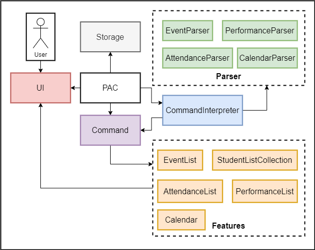
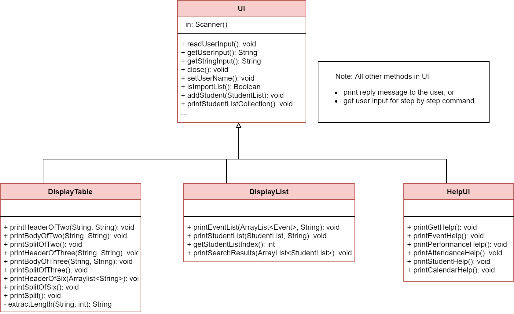
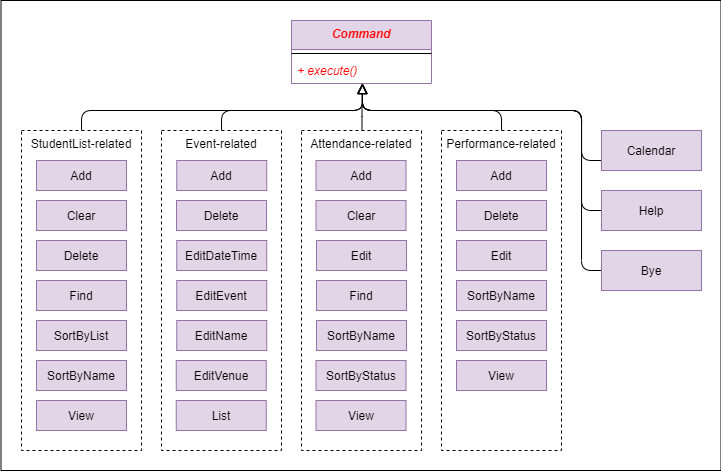
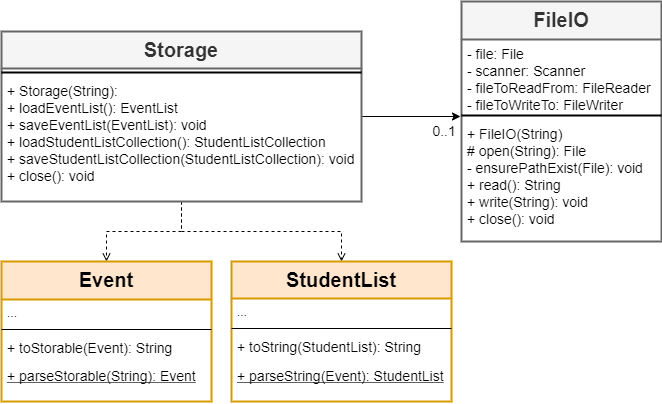
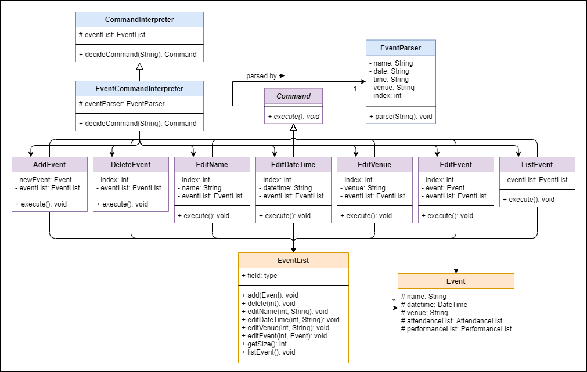

# Developer Guide
The design documentation is in general for anyone who wants to understand the system architecture and design of 
Pac. The following groups are in particular the intended audience of the document.

- PAC project managers
- PAC developers
- PAC software testers
## Table of Contents
1. [Setting Up](#1-setting-up)  
    1.1 [Requirements](#11-requirements)  
    1.2 [Startup using Command Line](#12-startup-using-command-line)  
    1.3 [Startup using Jar](#13-startup-using-jar)  
2. [Design](#2-design)  
    2.1 [Architecture](#21-overall-architecture)  
    2.2 [UI component](#22-ui-component)  
    2.3 [Command component](#23-command-component)  
    2.4 [Parse component](#24-parser-component)  
    2.5 [Storage component](#25-storage-component)
3. [Implementation](#3-implementation)  
    3.1 [Event](#31-event)  
    3.2 [Attendance](#32-attendance)  
    3.3 [Calendar](#33-calendar)  
    3.4 [Performance](#34-performance)  
    3.5 [Student List Collection](#35-student-list-collection)

[Appendix A: Target User Profile](#appendix-a-target-user-profile)   
[Appendix B: Value Proposition](#appendix-b-value-proposition)  
[Appendix C: Non-functional requirements](#appendix-c-non-functional-requirements)  
[Appendix D: User Stories](#appendix-d-user-stories)    
[Appendix E: Instructions for Manual Testing](#appendix-e-instructions-for-manual-testing)  
[Glossary](#glossary)  

## 1. Setting Up

### 1.1. Requirements 
1.  Ensure you have [Java 11](https://www.oracle.com/java/technologies/javase-jdk11-downloads.html) 
or above installed in your Computer.
1.  Download the latest PAC.jar from [here](https://github.com/AY1920S2-CS2113T-T12-4/tp/releases).
1.  Copy the file to the folder you want to use as the home folder for this application.
1.  Type `java -jar PAC.jar` to start the application.
1.  You should see this screen if everything is successful.

### 1.2 Startup using Command Line
1.  Open your terminal.
1.  Navigate to the home folder containing PAC.
1.  cd followed by the file path into the terminal as shown below
    <INSERT IMAGE> 
1.  Type `java -jar` followed by the name of the jar file and press **Enter**.

### 1.3 Startup using JAR
1.  Open home folder containing PAC.
1.  Run the packaged JAR file by double clicking it 
    and a window should appear in a few seconds.
    <INSERT IMAGE>
1. Once opened, type in the command when prompted and press **Enter**.

## 2. Design

### 2.1 Overall Architecture
This section presents the architecture of PAC. It explains the architecture of main components of PAC.

              
*Overall architecture design of Pac*

The `Pac` component contains all other components in the application.

- `UI`: reads user input, and prints output in pre-defined format.
- `Storage`: loads/stores all events (in EventList) and all student lists (in StudentListCollection).
- `CommandInterpreter`: Determines category and type of command from user input.
- Various `Parser`: Breaks down user input to obtain command parameters.
- Various `Features`: stores their respective objects during runtime.
    - `EventList`: stores all events during runtime.
    - `StudentListCollection`: stores all student lists during runtime.
    - `AttendanceList`: stores all attendances related to an `Event`.
    - `PerformanceList`: stores all performances related to an `Event`.
    - `Calendar`: shows all events in calendar form.

### 2.2 UI component
                
*Class diagram of the UI component*   

UI is the main class handles user display, which includes reading user input and printing information 
back to the user on command-line.  
Besides the normal command line messages, there are two subclasses of UI: 
DisplayList and DisplayTable, to specifically print the list and table interface to professor. 

### 2.3 Command component
         
*Class diagram of the Command component*  

Commands are the main classes to be executed in Pac. All of the specific Command classes inherit the 
base Command abstract class, and utilize its abstract execute() method.  
A subclass of Command is created and executed when the professor input a corresponding command.
 
### 2.4 Parser component
*Class diagram of the Parser component*  
There are total of four Parser classes as shown below. Each Parser class correspond to a feature 
of Pac. 

| Parser                    | Created in                                                    |
|---------------------------|---------------------------------------------------------------|
| EventParser               | EventCommandInterpreter                                       | 
| CalenderParser            | EventCommandInterpreter                                       | 
| PerformanceParser         | Step-by-step command at performance-related command classes   |  
| AttendanceParser          | Step-by-step command at attendance-related command classes    |  

A Parser class is created when a user input contains data to be stored or used in certain features.    

### 2.5 Storage component
            
*Class diagram of the Storage component*

On startup, `Pac` instantiates two `Storage` objects (`eventStorage` and 
`studentListStorage`) to load and save `Event` and `StudentList` objects respectively.

All `Event` and `StudentList` objects are receiving `Bye` command. If the 
program crashes (due to unhandled Exception or Interrupt), they *will not* be 
saved.

## 3. Implementation 
### 3.1 Event
               
*Class diagram of the Event component*

#### Program flow
1. When a user enters an event-related command, the command is analysed by `EventCommandInterpreter`. 
1. Once determined, the relevant information (e.g. index, name, time, date, venue) are extracted by 
`EventParser`.
1. Then, the relevant class that corresponds to the requested command is 
created, with the information extracted from the previous step passed into it. 
    - e.g. Command `event delete i/1` will create a `DeleteEvent` object, with 
    `index=1` as its argument.
1. These commands are then returned to `Pac.run()` to `execute()`. 

Note that:
* `datetime` is stored as a single attribute in `Event` class, but it is exposed to user as `date` 
and `time`, which corresponds to `d/` and `t/` flag respectively.
* `editDate` or `editTime` commands are not available. Only `editDateTime` is available to change the 
`date` and/or `time` of an `Event` object.
* `delete(Event)` method is currently not in use, but can be used to implement delete by event name, 
either by complete match, or fuzzy match.
* Any classes (e.g. `Seminar`) that inherit from `Event` class will have similar program flow. 

### 3.2 Attendance
        
*Class diagram of the Attendance component*
1. When a user enters an attendance-related command, the command is analysed by `AttendanceCommandInterpreter`. 
1. Once determined, the relevant class that corresponds to the type of command is created.
1. Then, the class will execute base on its function. It modifies `AttendanceList`.
1. These commands are then returned to `Pac.run()` to `execute()`. 

Note that:
* `attendance add` command requires a line-by-line insertion of the student attendance data. 
The user is given an option to either use an existing list stored under StudentListCollection or
create a new attendance list. `n/` and `p/` flags are used to insert new attendance.

### 3.3 Calendar
*Figure 2: Class diagram of the Calendar component*

1. When a user enters a calendar-related command, the command is analysed by `CalendarCommandInterpreter`.
1. Once determined, the relevant information (eg. semester, academic year) are extracted by `CalendarParser`.
1. Then, either AddFirstSemester or AddSecondSemester class that corresponds the semester number is created. 
1. Subsequently, it separates events by the required month and year in `CalendarList`
1. These commands are then returned to `Pac.run()` to `execute()`. 

Note that:
* `acadamic year` is parsed into corresponding to only one year according to the semester in `EventParser` class.
* Calendar view of the whole year is not available. Only semester 1 or 2 of an academic year can be viewed at a time.
* Event name size must be less than 10 characters to be displayed neatly (current implementation), however
it can be implement to truncate longer names to fit nicely

### 3.4 Performance
     
*Class diagram of the Performance component*  
1. When a user enters a performance-related command, the command is analysed by `PerformanceCommandInterpreter`. 
1. Once determined, the relevant class that corresponds to the command is created (e.g. AddPerformance, 
DeletePerformance...), and ask for relevant information (e.g. event name, student name, student result) from the user. 
1. Then, with the information extracted from the previous step passed into it. It modifies PerformanceList` under
the event class correspond to the input event name.
1. These commands are then returned to `Pac.run()` to `execute()`. 

Note that:
* All PerformanceList class should be created under an Event class. A PerformanceList class cannot exist 
by its own. 
* All Performance commands are line-by-line commands. This aims to assist the user with correct command format and
prevent time wasted on key in wrong commands. 

### 3.5 Student List Collection
     
*Class diagram of the Student component*  
1. When a user enters an studentList-related command, the command is analysed by `StudentCommandInterpreter`. 
1. Once determined, the relevant class that corresponds to the type of command is created.
1. Then, the class will execute base on its function. It modifies `AttendanceList`.
1. These commands are then returned to `Pac.run()` to `execute()`. 

Note that:
* studentList-related commands can be executed without the existence of events.

* *flag* - anything that takes the form of  `?/`, e.g. `n/`, `i/`

## Appendix

### Appendix A: Target user profile
Our target audiences are professors who need help organizing their personal work schedule and need more time.
The professors are pressed for time and they require a simple software to organize their monthly events
and keep track of their students' attendance and performance. 

### Appendix B: Value proposition
Our application will reduce the stress of the professor by allowing them to easily enter and store
their work schedule as well as their students' records. After storing the data, the Professor can have
quick access to the information in either a list or a calendar view. 

## Appendix C: Non-Functional Requirements

1. Should work on any mainstream OS as long as it has 
[Java 11](https://www.oracle.com/java/technologies/javase-jdk11-downloads.html) or above installed.
1. Should be able to hold up to 100 events without a noticeable sluggishness in performance for 
typical usage.
1. A user with above average typing speed for regular English text (i.e. not code, not 
system admin commands) should be able to accomplish most of the tasks faster using commands 
than using the mouse.

{More to be added in future revisions}

## Appendix D: User Stories

|Version| As a ... | I want to ... | So that I can ...|
|--------|----------|---------------|------------------|
|v1.0|professor|add new events|creating new events|
|v1.0|professor|delete existing events|delete unnecessary events|
|v1.0|professor|add new attendance list|create new attendance list to be added to events|
|v1.0|professor|delete existing attendance list|delete unnecessary attendance list|
|v1.0|professor|add new performance list|create new performance list to be added to events|
|v1.0|professor|delete existing performance list|delete unnecessary performance list|
|v1.0|professor|add date and time to my events|organize my events|
|v1.0|professor|add venue to my events|locate events|
|v1.0|professor|edit my events|update my existing events|
|v2.0|professor|create a student list|link existing student list to performance list or attendance list|
|v2.0|professor|Create repeatable events without having the need to manually add in|easily create occurring events|
|v2.0|professor|find an event by name|locate an event without having to go through the entire list|
|v2.0|professor|view calendar of all my events|to see a overview of them|

## Appendix E: Instructions for Manual Testing
#### Set up
1. Download the jar file and copy it into an empty folder.
1. Run the jar file by typing java -jar Pac-2.1.jar after going into the file's home directory 
folder in command terminal.  
 
#### Follow **all-in-one** command for following commands:  
**Event**
1. Add an event by typing  
`event add n/NAME`
1. View the populated events by typing  
`event list`
1. View the populated seminars by typing  
`seminar list`
1. Delete an event by typing  
`delete i/INDEX`
1. Edit an existing event's name by typing  
`event editname i/INDEX n/NAME`
1. Edit an existing event's date and time by typing  
`event editdatetime i/INDEX d/DATE t/TIME`
1. Edit an existing event's venue by typing   
`event editvenue i/INDEX v/VENUE`  

**Calender**
1. Display calendar by entering  
`calendar s/SEMESTER ay/YEAR_ONE-YEAR_TWO`   

#### Follow **step-by-step** command for following commands:  

**Attendance**
1. Add attendance to attendance list by typing  
`attendance add`
1. Clear attendance list by typing  
`attendance clear`
1. View generated table for attendance list by typing  
`attendance view`  
 
**Performance**
1. Sort performance list by typing
`performance sort`
1. Add performance to performance list by typing  
`performance add`
1. Delete a performance from performance list by typing  
`performance delete`
1. View generated table for performance list by typing  
`performance view` 
1. Edit performance list by typing  
`performance edit`
1. Sort performance list by typing
`performance sort`  

**Student name list**
1. Add name to student name list by typing  
`student add`
1. Delete name from student name list by typing  
`student delete`
1. View generated table for student name list by typing  
`student view` 
1. Find a student name in student name list by typing  
`student find`
1. Sort student list by typing
`student sort`

## Glossary

* *flag* - anything that takes the form of  `?/`, e.g. `n/`, `i/`
* *performance* - a combination of student's name and result
* *performance list* - a list of student's name and result
* *Calendar* - Display columns of event in a chosen semester, each column represents a month 
in the chosen semester 